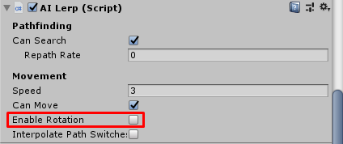
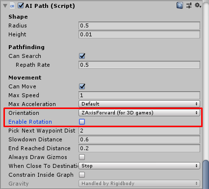
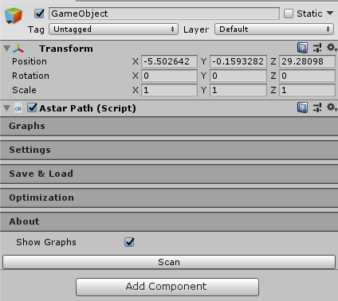
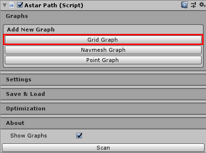
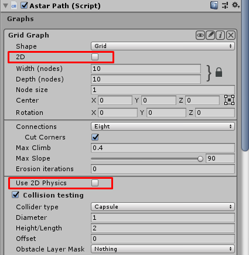
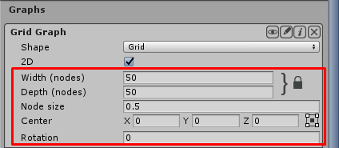
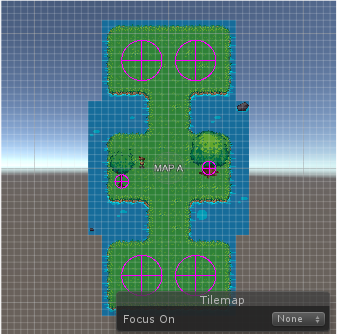
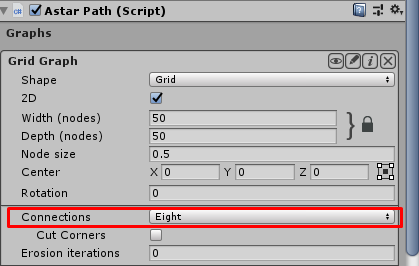

**This is document for older version (1.0) which work with MMORPG KIT version below 1.46**

# UnityMultiplayerARPG_2DAI

AI implement for 2D mode, which implements [A* Pathfinding Project](https://arongranberg.com/astar/)

Their package files will not included in this repository, visit their site to download it :)

## Setup Player Character Entity

- Change `Player Character Entity 2D` to `Player Character Entity 2DAI`
- Attach `AI Lerp` or `AI Path` component
- Don't enable rotation for `AI Lerp` or `AI Path`

- If you use `AI Path`, set `Orientation` to `YAxisForward (for 2D games)` set `Radius` and `Height` fit to your character

## Setup Monster Character Entity

- Change `Monster Activity Component 2D` to `Monster Activity Component 2DAI`
- Attach `AI Lerp` or `AI Path` component
- Don't enable rotation for `AI Lerp` or `AI Path`

- If you use `AI Path`, set `Orientation` to `YAxisForward (for 2D games)` set `Radius` and `Height` fit to your character

## Setup map scene

- Create empty game and attach `Pathfinder` component

- In `Graph` section select `Grid Graph`

- In `Grid Graph` setting, enable `2D` and `Use 2D Physics`

- Then set `Width`, `Depth`, `Node size` and `Center`, make it cover the map

- Set `Collider type` to `Point`
- Set `Obstacle Layer Mask` by select layers that you want to make it as obstacles

## Setup character to move in grid as 4 directions(UP/DOWN/LEFT/RIGHT)

- Use `AI Lerp` for characters
- Set `Pathfinder` → `Connections` to `Four`

## About AI Lerp and AI Path

- [AI Lerp](https://arongranberg.com/astar/docs/ailerp.html)
- [AI Path](https://arongranberg.com/astar/docs/aipath.html)

